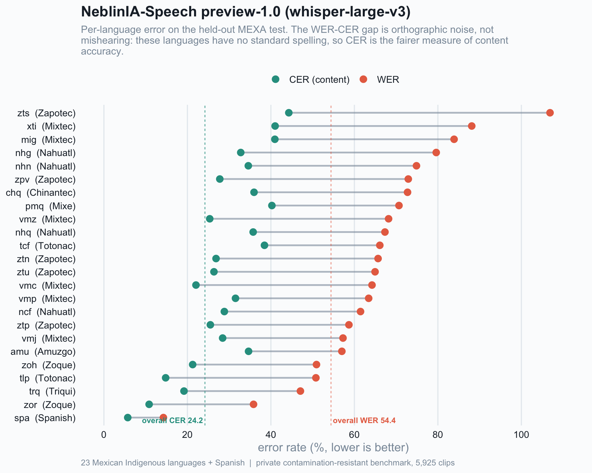
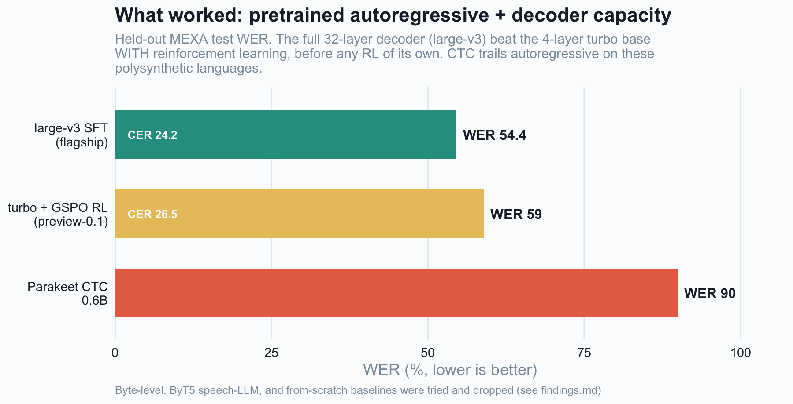

# MexicoSpeech — Training

Fine-tuning ASR models on **Mexican Indigenous speech**, starting from the gap the
`mexa-benchmark` exposed (every SOTA ≥99% WER on Indigenous languages). The goal is a
model that actually transcribes these languages, evaluated on the same held-out benchmark.

## Results — flagship: preview-1.0 (whisper-large-v3)

**WER 54.4 / CER 24.2** on the contamination-resistant MEXA test (Mexican Spanish + 23 Indigenous
languages). Model: [Thermostatic/neblinia-speech-preview-1.0](https://huggingface.co/Thermostatic/neblinia-speech-preview-1.0).
Read CER, not just WER: the gap is orthographic-convention mismatch (no standard spelling), not mishearing.




Data + benchmark are fully rebuildable from open sources: see [docs/RECREATE_DATA.md](docs/RECREATE_DATA.md).
The honest campaign log (including negative results) is in [docs/findings.md](docs/findings.md).

## Approach (v0)

- **Base**: `openai/whisper-large-v3-turbo`
- **Method**: LoRA via **Unsloth** (fast, low-memory)
- **Data**: Common Voice validated Indigenous (~75k clips, 10 locales, CC0, local) +
  CIEMPIESS Spanish (CC BY-SA) to avoid Spanish forgetting
- **Eval**: the held-out Omnilingual benchmark (a *different* corpus → clean, tests
  cross-variety transfer)

## Layout

| Path | What |
|---|---|
| `scripts/prep_train.py` | Build the training manifest from local CV + CIEMPIESS (TRAIN only) |
| `scripts/train_unsloth.py` | Unsloth Whisper LoRA fine-tune → `models/mexicospeech-v0/` |
| `models/` | Checkpoints + adapters (gitignored) |

## Decontamination

The benchmark is Omnilingual/CIEMPIESS-**test**; training uses CV + CIEMPIESS-**train**
(different corpora/splits). Train data is still filtered against the benchmark
fingerprint registry (`mexa-asr-fingerprints`) as a guarantee.

## Usage

```bash
NEBLINIA_DATA=/path/to/shared/data
uv run scripts/prep_train.py                                   # build manifest
.venv-unsloth/bin/python scripts/train_unsloth.py --epochs 1   # fine-tune (Unsloth env)
```

> Note: Unsloth wants `torch>=2.11` for its compiled kernels; pin accordingly in the
> training env.
